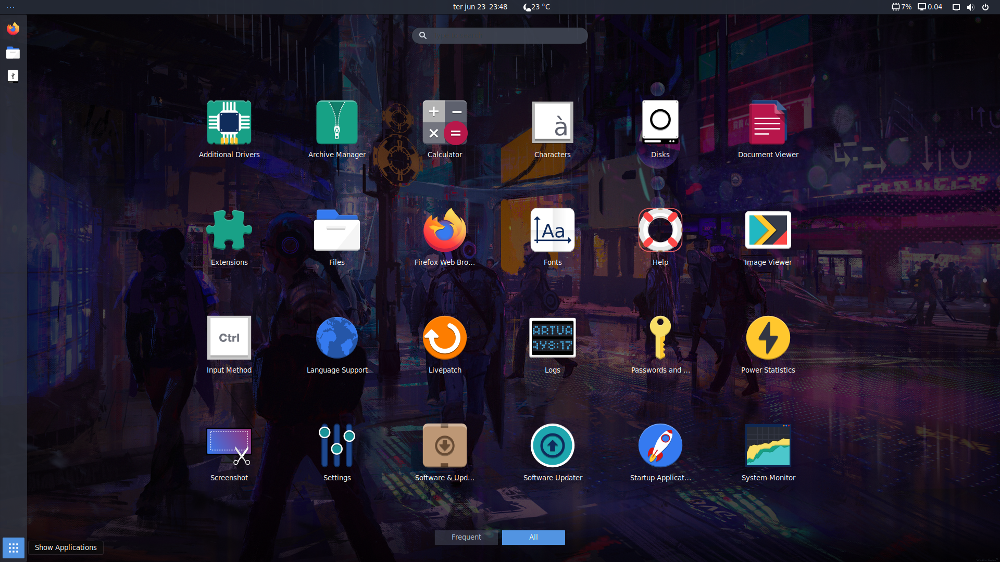

<h2 align="center"> 
	 My Desktop Configurations (Theme and Programs)
</h1>

  
  
  
  
  
  
  

  
   

## :bookmark_tabs: Resume of application

It's a theme, configurations and programs using in my work. I use Linux (Ubuntu 20.04 LTS), Android Studio, DataGrip, DBeaver, Eclipse, GitKraken, Insomnia, IntelliJ IDEA, Postman, PyCharm, Visual Studio, Tweaks Tool and extensions Openweather, Unite, User Themes, Vitals. 

	

	

### :hammer: Installing

For install it's so easy, you need execute the scripts.

## :family: Contributing

Please read [CONTRIBUTING.md](https://gist.github.com/PurpleBooth/b24679402957c63ec426) for details on our code of conduct, and the process for submitting pull requests to us.

## :chart_with_upwards_trend: Versioning

For the versions available, see the [tags on this repository](https://github.com/franklaercio/Ecoleta/tags). 

## :man_technologist: Authors

* **Frank Laércio** - [franklaercio](https://github.com/franklaercio)

See also the list of [contributors](https://github.com/franklaercio/Ecoleta/contributors) who participated in this project.

## :clipboard: License

This project is licensed under the MIT License - see the [LICENSE.md](LICENSE.md) file for details

## :newspaper: Acknowledgments

* Theme
* Shell
